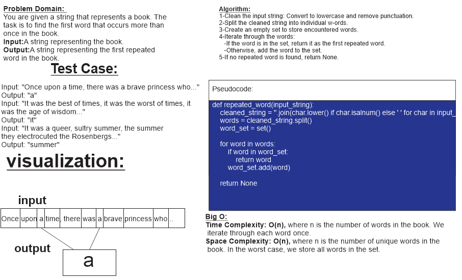

# Code Challenge no.31: hashmap-repeated-word

## whiteboard:

## Approach & Efficiency

**Approach:**

The approach to finding the first repeated word in the book involves the following steps:

1. Clean the input string: Convert the entire input string to lowercase and remove any punctuation or special characters, keeping only alphanumeric characters and spaces.

2. Split the cleaned string into individual words: Use the Python `split()` method to separate the cleaned string into a list of words.

3. Create an empty set to store encountered words. The set data structure will help us efficiently check if a word has already been encountered.

4. Iterate through the list of words:
   - For each word encountered:
      - Check if the word is already in the set of encountered words. If yes, return the word as it is the first repeated word.
      - If the word is not in the set, add it to the set and continue to the next word.

5. If no repeated word is found after iterating through all words, return `None` to indicate that there is no repeated word in the book.

**Efficiency:**

- Time Complexity: The time complexity of the main function `repeated_word` is O(n), where n is the number of words in the book. We iterate through each word once to check for duplicates and add them to the set. Splitting the string and cleaning it involves traversing each character once as well, which does not change the overall complexity. In the worst case, the algorithm may need to iterate through all words to find the first repeated word.

- Space Complexity: The space complexity of the main function `repeated_word` is O(m), where m is the number of unique words in the book. We use a set to store encountered words, and in the worst case, it may contain all unique words in the book. The space used for the cleaned string and the list of words is O(n), where n is the total number of characters in the book. For the stretch goals (word count and most frequent words), additional data structures may be used to store word counts and frequent words, contributing to additional space complexity.

Overall, the approach and efficiency ensure that the function can efficiently find the first repeated word in a given book-like string, and the additional stretch goals allow for more insights into the words' occurrences and frequencies within the text.

## Solution

[link to code](hashtable.py)