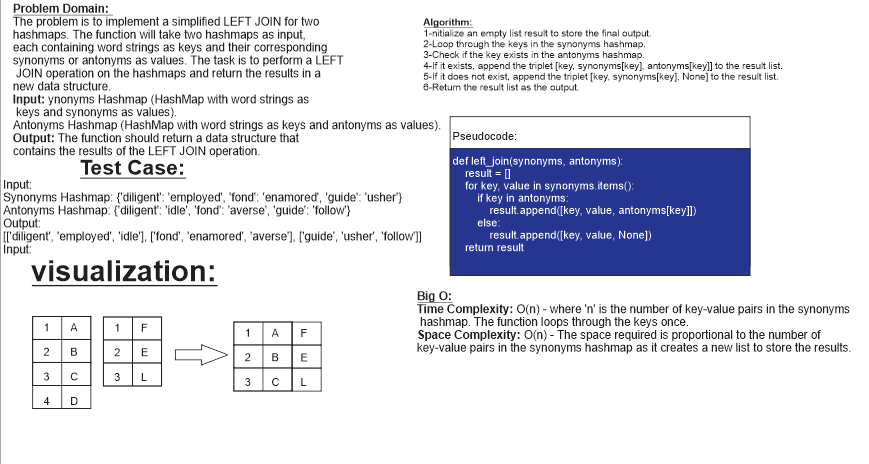

# Code Challenge no.33:hashmap_left_join

## Whiteboard

## Approach & Efficiency

**Approach:**
The approach to solving this problem involves performing a LEFT JOIN operation on two hashmaps containing word strings as keys and their corresponding synonyms or antonyms as values. The goal is to combine the key and corresponding values from the `synonyms` hashmap with the matching values from the `antonyms` hashmap, following the LEFT JOIN logic.

To achieve this, we'll iterate through the keys of the `synonyms` hashmap. For each key, we'll check if it also exists in the `antonyms` hashmap. If it does, we'll append a triplet `[key, synonyms[key], antonyms[key]]` to the result list. If the key is not present in the `antonyms` hashmap, we'll append the triplet `[key, synonyms[key], None]`.

**Efficiency:**
Let's analyze the efficiency of the `left_join` function:

- Time Complexity: O(n)
  - The function loops through the keys of the `synonyms` hashmap, where 'n' is the number of key-value pairs in the `synonyms` hashmap. The time complexity is directly proportional to the number of elements in the `synonyms` hashmap.
  - The lookup operation for checking if a key exists in the `antonyms` hashmap also takes O(1) time on average due to the nature of hashmaps.

- Space Complexity: O(n)
  - The space complexity is also directly proportional to the number of key-value pairs in the `synonyms` hashmap, as the function creates a new list `result` to store the output. The size of the `result` list will be equal to the number of elements in the `synonyms` hashmap.
  - Additional space used by the function is constant, as it uses a fixed number of variables for temporary storage.

## Solution

[link to code](hashmap_left_join.py)
