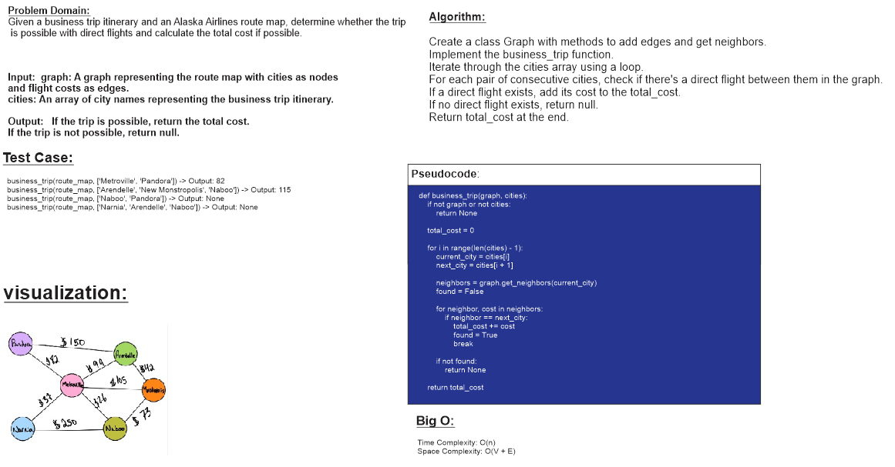

# Code Challenge no.37:graph business trip

**Author: Hasan Alrawaqa**

## Whiteboard

## Approach & Efficiency

**Approach:**

To solve this problem, we'll follow these steps:

1. Create a graph data structure to represent the route map of Alaska Airlines. Each node represents a city, and each edge between nodes represents a direct flight with associated cost.

2. Write a function `business_trip(graph, cities)` to calculate the total cost of the business trip.

3. Iterate through the `cities` array and check if there's a direct flight between consecutive cities. If a direct flight exists, add its cost to the `total_cost`. If not, return `null` indicating the trip is not possible.

4. Return the `total_cost` if the entire itinerary is feasible with direct flights.

**Efficiency:**

- **Time Complexity:** The time complexity of this solution is O(N), where N is the number of cities in the itinerary. In the worst case, we iterate through all cities once to check for direct flights and calculate the total cost.

- **Space Complexity:** The space complexity is O(V + E), where V is the number of cities (vertices) in the graph and E is the number of flight routes (edges). This accounts for the memory used to store the graph's adjacency list representation.

This approach is efficient as it iterates through the cities once and looks up the flights in the graph, resulting in a linear time complexity. The space complexity is also reasonable, considering the data structure used to represent the graph.

## Solution
[link to code](graph-business-trip.py)

