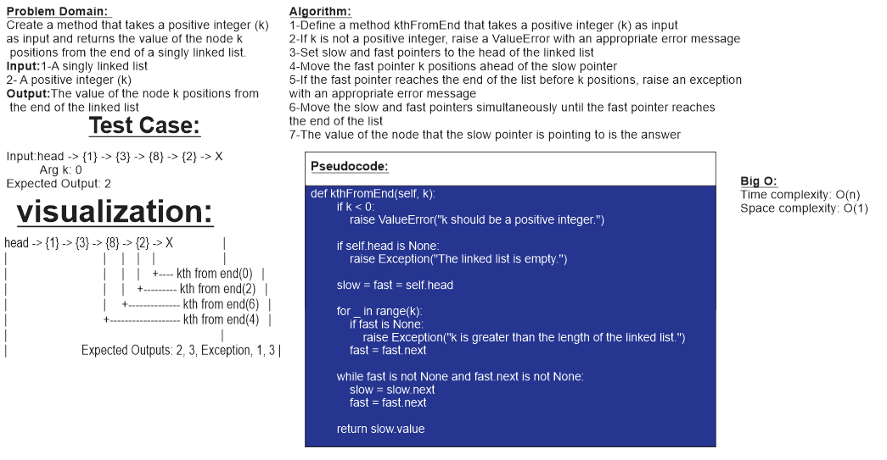

# Challenge 07

The code challenge is to implement a method in a singly linked list class that finds the kth node from the end of the list. The method should take an integer k as a parameter and return the value of the kth node from the end of the list. If k is greater than the length of the list, it should raise an exception. If k is negative or zero, it should raise a ValueError. The challenge also requires writing test cases to ensure the code works as expected.

## Whiteboard Process

## Approach & Efficiency

The approach to solving the kth from the end of a linked list problem is as follows:

1. We will use two pointers, slow and fast, initially pointing to the head of the linked list.
2. Move the fast pointer k positions ahead of the slow pointer.
3. If the fast pointer reaches the end of the list before k positions, it means that k is greater than the length of the linked list. In this case, we raise an exception.
4. Move both the slow and fast pointers simultaneously until the fast pointer reaches the end of the list.
5. The value of the node that the slow pointer is pointing to will be the kth node from the end of the linked list.

The time complexity of this approach is O(n) because we iterate through the linked list once to reach the kth node from the end.
The space complexity is O(1) because we are using only two pointers and not creating any additional data structures.

In terms of efficiency, this approach provides a linear time complexity, which is optimal for this problem. By using two pointers, we avoid the need to traverse the linked list twice or to calculate the length of the list. Thus, we can find the kth node from the end of the linked list in a single pass.

## Solution

[link to code](linked_list/linked_list.py)
