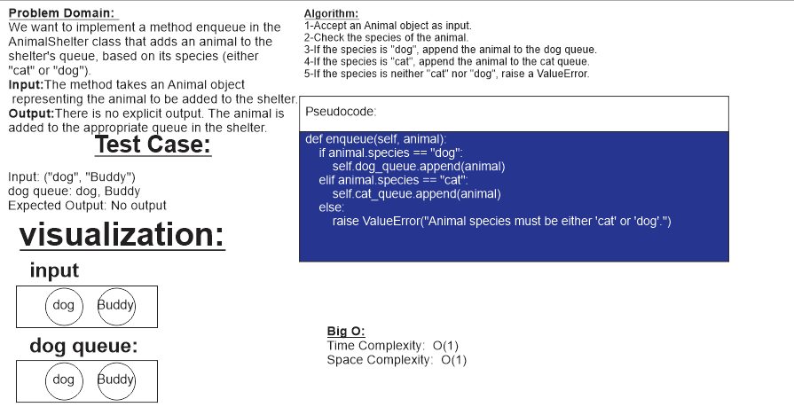

# ***Code Challenge: Class 12***

## ***Task: bulid Animal Shelter for dogs and cats***

## ***Whiteboard Process***

**enqueue method**

**dequeue method**

## ***Approach & Efficiency***

### Approach: 

The AnimalShelter class maintains two queues, one for dogs and one for cats, to implement the first-in, first-out approach. When an animal is enqueued, it is added to the respective queue based on its species. When an animal is dequeued, the method checks the preference (dog or cat) and returns the oldest animal of that preference from the corresponding queue. If the preference is not valid or there are no animals of that preference in the queue, it returns None.

### Methods:

enqueue(animal)

This method adds an animal to the shelter's queue.
Arguments:
animal (Animal): The animal to be added to the shelter.
Returns: None
Steps:
Accept an Animal object as input.
Check the species of the animal.
If the species is "dog", append the animal to the dog queue.
If the species is "cat", append the animal to the cat queue.
If the species is neither "cat" nor "dog", raise a ValueError.
dequeue(pref)

This method removes and returns the oldest animal of the specified preference from the shelter's queue.
Arguments:
pref (str): The preference for either a "dog" or a "cat".
Returns:
Animal or None: The oldest animal of the specified preference, or None if the preference is invalid or there are no animals of that preference in the queue.
Steps:
Accept a preference pref as input.
If pref is "dog":
Check if the dog queue is not empty.
If it's not empty, remove and return the oldest dog from the dog queue.
If it's empty, return None.
If pref is "cat":
Check if the cat queue is not empty.
If it's not empty, remove and return the oldest cat from the cat queue.
If it's empty, return None.
If pref is neither "cat" nor "dog", return None.

## ***Solution***

[link to code](animal_shelter.py)