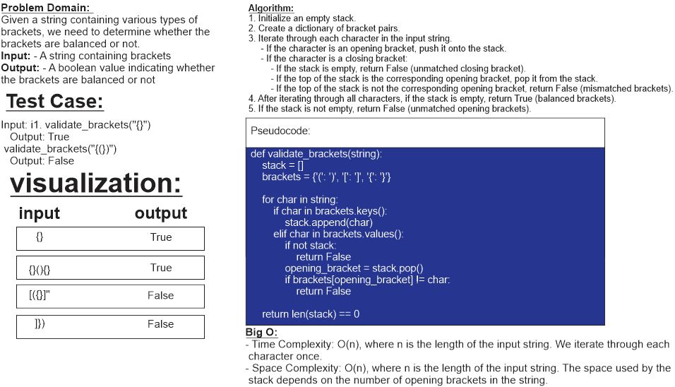

# ***Code Challenge: Class 13***

## ***Task: Multi-bracket Validation.***

## ***Whiteboard Process***

## ***Approach & Efficiency***

### Approach:

The approach to solve the "Multi-bracket Validation" problem is to use a stack data structure. We iterate through each character in the input string and perform the following steps:

1. If the character is an opening bracket (i.e., '{', '[', or '('), we push it onto the stack.
2. If the character is a closing bracket (i.e., '}', ']', or ')'), we check if the stack is empty. If it is, it means there is an unmatched closing bracket, and we return False.
3. If the stack is not empty, we check the top of the stack to determine if it matches the current closing bracket. If they match, we pop the opening bracket from the stack.
4. If the top of the stack does not match the current closing bracket, it means there is a mismatched pair of brackets, and we return False.
5. After iterating through all characters, if the stack is empty, it means all opening brackets have been matched and removed, and we return True. Otherwise, there are unmatched opening brackets, and we return False.

### Efficiency:

- Time complexity: O(n), where n is the length of the input string. We iterate through each character once.
- Space complexity: O(n), where n is the length of the input string. In the worst case, when all characters are opening brackets, they will be stored in the stack.

## ***Solution***

[link to code](stack_queue_brackets.py)
