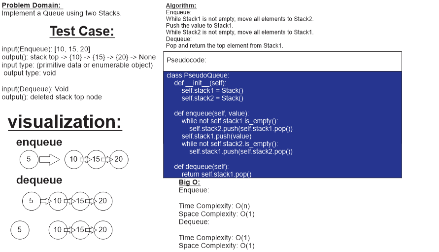

# ***pesudo queue***

## ***Task: Implement a Queue using two Stacks.***

## ***Whiteboard Process***

## ***Approach & Efficiency***

Approach:
The approach for implementing a PseudoQueue using two Stacks involves utilizing the Stack data structure to mimic the behavior of a queue. The main idea is to use one stack for enqueue operations and another stack for dequeue operations. When an element is enqueued, it is pushed onto the enqueue stack. When a dequeue operation is performed, the elements are transferred from the enqueue stack to the dequeue stack in reverse order, allowing the front element to be popped from the dequeue stack.

Efficiency:
The time complexity of the enqueue operation is O(1) because it simply involves pushing an element onto the enqueue stack. The dequeue operation has an amortized time complexity of O(1) as well. When the dequeue stack is not empty, the front element can be directly popped from it. If the dequeue stack is empty, the elements are transferred from the enqueue stack to the dequeue stack in O(n) time, where n is the number of elements in the enqueue stack. However, since the elements are transferred only when necessary, the average time complexity for dequeue operations remains constant.

Overall, the PseudoQueue implementation using two Stacks provides a way to enqueue and dequeue elements with efficient time complexity, ensuring the first-in, first-out behavior of a queue.

## ***Solution***

[link to code](pseudo_queue.py)