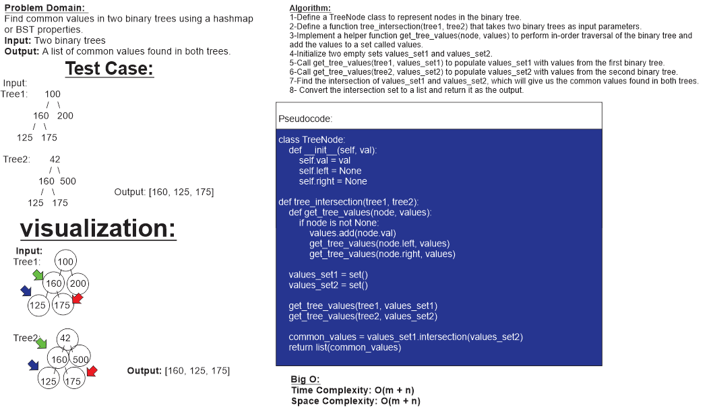

# ***Code Challenge: Class 32***

## ***Task: tree_intersection***

## ***Whiteboard Process***

## ***Approach & Efficiency***

**Approach:**

1. Define a TreeNode class to represent nodes in the binary tree.
2. Define a function `tree_intersection(tree1, tree2)` that takes two binary trees as input parameters.
3. Implement a helper function `get_tree_values(node, values)` to perform an in-order traversal of the binary tree and add the values to a set called `values`.
4. Initialize two empty sets `values_set1` and `values_set2`.
5. Call `get_tree_values(tree1, values_set1)` to populate `values_set1` with values from the first binary tree.
6. Call `get_tree_values(tree2, values_set2)` to populate `values_set2` with values from the second binary tree.
7. Find the intersection of `values_set1` and `values_set2`, which will give us the common values found in both trees.
8. Convert the intersection set to a list and return it as the output.

**Efficiency Analysis:**

1. Time Complexity:
   - The `get_tree_values` function performs an in-order traversal of each binary tree. For a binary tree with `m` nodes, the time complexity of in-order traversal is O(m) because we visit each node once.
   - Therefore, the time complexity of calling `get_tree_values` for both trees is O(m + n).
   - The intersection of two sets using `intersection()` takes O(min(len(set1), len(set2))) time, which is also O(m + n) in this case.
   - Overall, the time complexity of the `tree_intersection` function is dominated by the in-order traversals and finding the intersection, resulting in O(m + n) time complexity.

2. Space Complexity:
   - The space complexity is determined by the two sets `values_set1` and `values_set2` used to store values from each binary tree.
   - For a binary tree with `m` nodes, the maximum size of the set is `m` because we add each node's value to the set once.
   - Therefore, the space complexity for each set is O(m).
   - Since we create two sets, the overall space complexity is O(m + n) to store values from both trees.

In summary, the first method using a Hashmap has a time complexity of O(m + n) and a space complexity of O(m + n), where `m` is the number of nodes in the first binary tree and `n` is the number of nodes in the second binary tree.

## ***Solution***

[link to code](tree_intersection.py)
